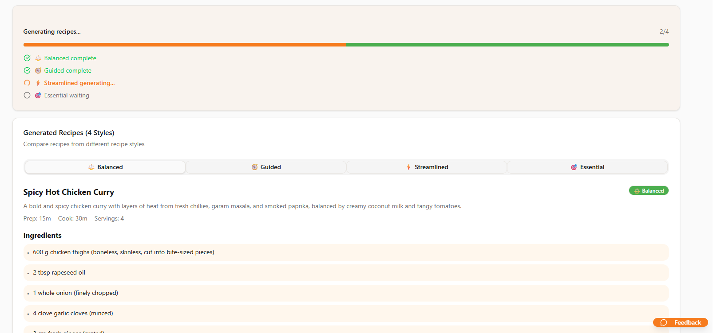
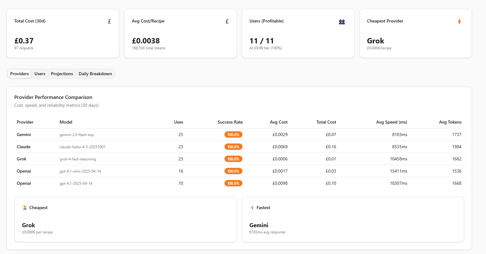
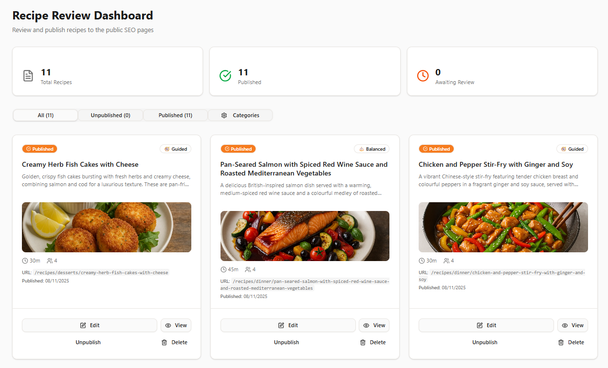
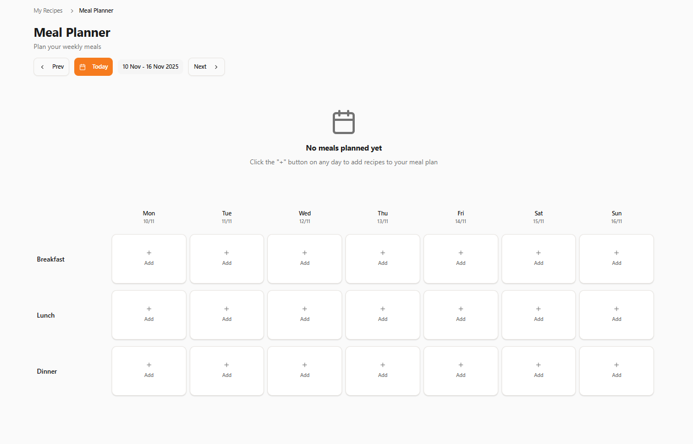

# PlateWise - AI Recipe Manager

> **UK-focused recipe generation platform with multi-AI comparison and cost tracking**

[](https://platewise.xyz)
[](https://nextjs.org/)
[](https://www.typescriptlang.org/)
[](https://supabase.com/)

## ⚠️ Demo Project Notice

**This is a portfolio demonstration project.** The application is fully functional and deployed, but is **not commercially available**. AI-generated recipes have not been tested in real kitchens and should not be used for actual cooking or relied upon for allergen safety.

[Live Demo](https://platewise.xyz) (view only - recipes are AI-generated and untested)

---

## Project Overview

PlateWise generates personalized recipes using AI, specifically targeting UK home cooks. Users input available ingredients and dietary restrictions, then receive four different recipe styles in approximately 30 seconds from different AI providers, allowing them to choose their preferred approach.

**Project Status:** Feature-complete MVP deployed for demonstration purposes. Not commercially launched as AI-generated recipes require human kitchen testing and safety validation before publication. Development paused pending implementation of testing protocols.

### Why I Built This

I wanted to demonstrate my ability to:
- Architect and direct a full-stack SaaS application using AI assistance
- Integrate multiple AI providers with intelligent routing
- Implement proper authentication and data security
- Build comprehensive admin tools and analytics
- Deploy a production-ready application to the web

### What I Learned

This project taught me how to:
- Work with multiple AI provider SDKs simultaneously
- Design database schemas that evolve over time (31 migrations)
- Integrate modern authentication (Clerk + Supabase 2025 approach)
- Set up automated jobs and background processes
- Make architectural decisions balancing features vs. complexity
- Identify when to pause development (regulatory/safety considerations)

---

## Screenshots

### Recipe Generation (4 AI Providers)

*Four different AI providers generate unique variations of the same dish*

### Cost Tracking Dashboard

*Real-time tracking of AI usage, costs, and provider comparison*

### Admin Recipe Review

*Review interface for managing recipe publication and SEO metadata*

### Meal Planning

*Complete meal planning workflow from generation to calendar*

---

## Tech Stack

### Core Technologies

**Frontend**
- Next.js 15 (App Router with React Server Components)
- TypeScript (88.1% of codebase)
- Tailwind CSS + Radix UI
- React Hook Form + Zod validation

**AI Integration**
- OpenAI (GPT-4.1 and GPT-4.1-mini)
- Anthropic (Claude Haiku 4.5)
- Google (Gemini 2.5 Flash)
- XAI (Grok 4)

**Backend & Database**
- Supabase (PostgreSQL database + Edge Functions)
- Clerk (Authentication with Google SSO)
- Vercel (Hosting and deployment)
- Vercel Blob Storage (Image hosting)

### Why These Choices?

- **4 AI Providers**: Gives users variety and lets me compare performance/cost
- **Next.js 15**: Modern React framework with server components for performance
- **Clerk + Supabase**: Recommended 2025 integration approach for auth
- **TypeScript**: Type safety helps catch errors during development
- **Vercel**: Easy deployment with good free tier for demos

---

## Key Features

### 1. Multi-AI Recipe Generation

**What it does:**
Users get four different recipe variations generated simultaneously by different AI providers, each with a distinct style:
- **Balanced** (OpenAI): Well-rounded recipes with standard instructions
- **Guided** (Anthropic): Detailed step-by-step guidance for beginners
- **Streamlined** (Gemini): Quick, efficient recipes for experienced cooks
- **Essential** (XAI): Minimalist approach with core ingredients only

**How it works:**
- User inputs ingredients, dietary restrictions, and allergies
- Request is sent to all 4 AI providers in parallel
- Each AI generates a unique recipe based on the same requirements
- Results display side-by-side for easy comparison

**Why this matters:**
Different AI models have different strengths. Letting users compare helps them find their preferred style.

### 2. Complexity-Based Prioritization

**What it does:**
Requests with allergens or complex dietary restrictions are treated as higher priority and may be routed to more capable AI models.

**How it works:**
- Each request gets a complexity score based on:
  - Number of ingredients
  - Number of allergens (weighted higher for safety)
  - Number of dietary restrictions
  - Presence of user description
- Higher complexity scores ensure safety-critical requests get appropriate AI capacity

**Why this matters:**
Allergen safety is non-negotiable. This system prioritizes accuracy where it matters most.

### 3. Cost Tracking & Analytics

**What it does:**
Every AI request is logged with provider, model, token usage, and calculated cost.

**How it works:**
- Each recipe generation writes to a usage log table in PostgreSQL
- Admin dashboard queries this data to show:
  - Total costs by provider and model
  - Average cost per recipe
  - Token usage patterns
  - Provider performance comparison
- Edge Function runs daily (via cron) to aggregate historical data

**Why this matters:**
Understanding AI costs is critical for any production app. This data helps make informed decisions about which providers to use.

### 4. Admin Review Workflow

**What it does:**
Admin users can review AI-generated recipes, edit metadata, and manage publication.

**How it works:**
- Clerk authentication with user metadata determines admin status
- Admins see all recipes from automation accounts
- Can edit SEO metadata, categories, allergen tags
- Can publish recipes to public pages or keep private
- Automatic FAQ generation for published recipes

**Why this matters:**
AI-generated content needs human review before public use. This workflow makes that manageable.

### 5. Complete User Journey

**What it does:**
Beyond recipe generation, includes meal planning, shopping lists, and pantry management.

**Features:**
- **Meal Planner**: Weekly calendar for scheduling recipes
- **Shopping Lists**: Auto-generated from meal plans with ingredient aggregation
- **Pantry Staples**: Track ingredients you always have on hand
- **User Preferences**: Onboarding flow captures dietary needs, cuisines, skill level

**Why this matters:**
Shows ability to build complete product experiences, not just isolated features.

### 6. UK Market Focus

**What it does:**
All recipes use British measurements, ingredient names, and cooking terminology.

**Examples:**
- Metric measurements (grams, ml, °C) not imperial (cups, Fahrenheit)
- British ingredient names (courgette not zucchini, aubergine not eggplant)
- References to UK supermarkets (Tesco, Sainsbury's, Asda)
- Cooking terminology UK users expect

**Why this matters:**
Demonstrates market research and localization skills. Most recipe apps are US-focused, leaving UK users underserved.

### 7. Mobile-First Design

**What it does:**
Fully responsive interface optimized for mobile devices with touch-friendly interactions.

**Mobile-specific features:**
- Hamburger navigation menu for compact mobile layout
- Card-based layouts that stack beautifully on small screens
- Touch-optimized controls for recipe browsing and meal planning
- Every page tested and refined for mobile user experience
- Consistent design language across all device sizes

**Why this matters:**
Most users access recipe apps on mobile while cooking. A mobile-first approach ensures the best experience where it's needed most.

---

## Technical Architecture

### System Overview

```
┌──────────────────────────────────────────────────────┐
│                   User Interface                      │
│              Next.js App Router (RSC)                 │
└────────────────────┬─────────────────────────────────┘
                     │
                     ▼
┌──────────────────────────────────────────────────────┐
│                 API Routes Layer                      │
│        (Authentication, Validation, Routing)          │
└──────┬────────────────────────────────────────┬──────┘
       │                                         │
       ▼                                         ▼
┌─────────────────┐                  ┌──────────────────┐
│  AI Providers   │                  │   Supabase DB    │
│  ┌────────────┐ │                  │   - Recipes      │
│  │  OpenAI    │ │                  │   - Users        │
│  │  Anthropic │ │                  │   - Usage Logs   │
│  │  Gemini    │ │                  │   - Meal Plans   │
│  │  XAI       │ │                  │   - Admin Data   │
│  └────────────┘ │                  └──────────────────┘
└─────────────────┘
         │
         ▼
┌──────────────────────────────────────────────────────┐
│           Edge Functions (Scheduled Jobs)             │
│        Daily aggregation, cleanup, analytics          │
└──────────────────────────────────────────────────────┘
```

### Data Flow

1. **User Authentication**: Clerk handles sign-in with Google SSO support
2. **Recipe Generation**: User submits request → API validates → Routes to 4 AI providers
3. **Data Storage**: Recipes and usage logs saved to Supabase PostgreSQL
4. **Admin Access**: Clerk user metadata determines admin privileges
5. **Background Jobs**: Cron-scheduled Edge Functions aggregate analytics daily

---

## Database Design

### Schema Highlights

**31 Migrations**: The database schema evolved over time as requirements became clearer. These migrations show iterative development and professional database management practices.

**Key Tables:**
- `recipes` - Recipe data with JSONB for flexible ingredient/instruction storage
- `user_profiles` - User preferences, dietary restrictions, allergen information
- `ai_usage_logs` - Every AI request logged with tokens, costs, and performance
- `meal_plans` & `meal_plan_items` - Weekly meal scheduling
- `shopping_lists` & `shopping_list_items` - Auto-generated shopping lists
- `user_pantry_staples` - Ingredients users always have available

**Security:**
- Row-Level Security (RLS) policies ensure users can only access their own data
- Public recipes visible to all users
- Admin access controlled via Clerk session metadata

**Automated Jobs:**
- Daily analytics aggregation via pg_cron
- Edge Functions for background processing
- Scheduled cleanup tasks

---

## Authentication & Security

### Clerk + Supabase Integration

**Approach:** Using the 2025 recommended Clerk-Supabase integration method (new approach, not the deprecated 2024 version)

**Authentication Flow:**
1. Users sign in via Clerk (email or Google SSO)
2. Clerk issues JWT tokens
3. Supabase reads JWT for user identification
4. Row-Level Security policies enforce data isolation

**Admin Access:**
- Configured in Clerk dashboard using Sessions customization
- User metadata determines admin status
- No hardcoded admin credentials in code
- Environment variables define admin user IDs for additional control

**What I Configured:**
- Google SSO in Clerk dashboard
- Clerk-Supabase JWT integration
- Session claims for admin users
- RLS policies in Supabase
- Middleware route protection in Next.js

### Security Implementation

PlateWise implements comprehensive security measures following industry best practices:

**Protection Against:**
- ✅ SQL Injection (parameterized queries via Supabase)
- ✅ Cross-Site Scripting / XSS (React escaping + CSP headers + input sanitization)
- ✅ CSRF Attacks (Next.js built-in protection)
- ✅ Clickjacking (X-Frame-Options headers)
- ✅ Rate Limiting (5 req/min for AI, 20 req/hour for recipes)
- ✅ Unauthorized Access (Row-Level Security + Clerk auth)

**Security Features:**
- Input validation at multiple layers (client, server, database)
- Content Security Policy (CSP) headers
- Rate limiting on all API endpoints
- Input sanitization with XSS pattern detection
- HTTPS enforced in production (TLS 1.3)
- Regular dependency vulnerability scanning

**For Details:** See [SECURITY.md](SECURITY.md) for comprehensive security documentation.

---

## Cost Tracking Implementation

### How It Works

**Logging:**
Every recipe generation request logs:
- AI provider used (OpenAI, Anthropic, Gemini, XAI)
- Specific model (GPT-4.1, Claude Haiku, etc.)
- Input tokens and output tokens
- Calculated cost based on provider pricing
- Response time in milliseconds
- Whether recipe generation succeeded

**Analytics:**
- Admin dashboard displays aggregated data
- Daily Edge Function summarizes usage patterns
- Identifies most/least expensive providers
- Tracks average cost per recipe
- Monitors success/failure rates

**Why This Matters:**
AI costs can spiral quickly. Tracking lets me make data-driven decisions about which providers to use and when.

---

## SEO Implementation

### Public Recipe Pages

**Features:**
- Dynamic sitemap generated from published recipes database
- Schema.org Recipe markup for Google rich snippets
- Automatic URL slug generation
- OpenGraph metadata for social sharing
- Category landing pages (breakfast, lunch, dinner, desserts, etc.)

**Approach:**
- AI generates recipe, admin reviews and adds SEO metadata
- Published recipes get unique URLs: `/recipes/[category]/[slug]`
- FAQ sections auto-generated for SEO value
- No fake ratings (follows Google guidelines)

**Note:** This is a demonstration of SEO knowledge. The site is not being actively optimized for search traffic since it's a portfolio piece.

---

## Local Development Setup

### Prerequisites

- Node.js 18+
- Supabase account
- Clerk account
- At least one AI provider API key (OpenAI, Anthropic, Google, or XAI)

### Installation

1. **Clone the repository**
   ```bash
   git clone https://github.com/web3at50/recipe-app.git
   cd recipe-app/frontend
   ```

2. **Install dependencies**
   ```bash
   npm install
   ```

3. **Configure environment variables**

   Create `.env.local` in the frontend directory:

   ```env
   # Clerk Authentication
   NEXT_PUBLIC_CLERK_PUBLISHABLE_KEY=your_clerk_key
   CLERK_SECRET_KEY=your_clerk_secret
   NEXT_PUBLIC_CLERK_SIGN_IN_URL=/sign-in
   NEXT_PUBLIC_CLERK_SIGN_UP_URL=/sign-up

   # Supabase
   NEXT_PUBLIC_SUPABASE_URL=your_supabase_url
   NEXT_PUBLIC_SUPABASE_ANON_KEY=your_anon_key

   # AI Providers (at least one required)
   OPENAI_API_KEY=your_openai_key
   ANTHROPIC_API_KEY=your_anthropic_key
   GOOGLE_GEMINI_API_KEY=your_google_key
   XAI_API_KEY=your_xai_key

   # Vercel Blob Storage
   BLOB_READ_WRITE_TOKEN=your_blob_token

   # Admin Access
   ADMIN_USER_IDS=comma,separated,clerk,user,ids
   AUTOMATION_USER_IDS=comma,separated,clerk,user,ids
   ```

4. **Set up Supabase database**

   Run migrations from the `supabase/migrations/` directory using Supabase CLI or SQL editor.

5. **Run development server**
   ```bash
   npm run dev
   ```

   Open http://localhost:3000

### Important Notes

- The app will work with just one AI provider configured, but you'll only get one recipe style
- Admin features require configuring ADMIN_USER_IDS with your Clerk user ID
- See Supabase and Clerk documentation for detailed setup instructions

---

## Project Statistics

- **Commits**: 134 showing real iterative development
- **TypeScript**: 88.1% of codebase
- **Database Migrations**: 31 schema evolutions
- **AI Providers**: 4 integrated (OpenAI, Anthropic, Google, XAI)
- **Main Features**: Recipe generation, meal planning, shopping lists, admin review, cost tracking
- **Tables**: 12+ with comprehensive RLS policies
- **Deployment**: Live on Vercel at platewise.xyz

---

## What This Project Demonstrates

### Technical Skills

✅ **Full-Stack Development**: Next.js frontend, API routes, database design
✅ **AI Integration**: Multiple provider SDKs with intelligent routing
✅ **Authentication**: Modern auth approach (Clerk + Supabase 2025 method)
✅ **Security**: Comprehensive protection (input validation, XSS/SQL injection prevention, CSP, rate limiting)
✅ **Database Management**: PostgreSQL with migrations, RLS, and scheduled jobs
✅ **Deployment**: Production deployment on Vercel with custom domain
✅ **Type Safety**: TypeScript throughout for error prevention

### Product & Design Skills

✅ **Market Research**: Identified UK market gap and localized accordingly
✅ **User Experience**: Complete journey from generation to meal planning
✅ **Feature Prioritization**: Focused on core value (4 AI comparisons) first
✅ **Safety Consciousness**: Paused for human testing before public launch
✅ **Analytics**: Built cost tracking from day one for sustainability

### Professional Practices

✅ **Iterative Development**: 31 migrations and 134 commits show evolution
✅ **Security-First**: Multi-layered protection, input validation, rate limiting, comprehensive security audit
✅ **Documentation**: Clear README, dedicated SECURITY.md, environment variable templates
✅ **Responsible Development**: Paused when safety requirements became clear

---

## Why Development Is Paused

### The Challenge

AI-generated recipes sound appealing, but they come with significant responsibility:

1. **Food Safety**: Recipes could contain unsafe ingredient combinations or cooking methods
2. **Allergen Accuracy**: AI might miss cross-contamination risks or hidden allergens
3. **Untested Instructions**: Cooking times, temperatures, and techniques need real-world validation
4. **Liability**: Publishing untested recipes could harm users

### The Solution Required

Before commercial launch, each recipe would need:
- Human chef review for technique accuracy
- Kitchen testing to verify cooking times and temperatures
- Allergen verification by qualified professionals
- Taste testing to ensure quality

### Why This Decision Matters

This demonstrates professional judgment: knowing when to pause development based on real-world constraints, not just technical feasibility.

**The app works perfectly from a technical standpoint.** But "working code" ≠ "ready for public use."

---

## Future Enhancements

If I were to resume development with proper testing infrastructure:

### Near-Term
- Enhance the recipe generation page which is the heart of the site.   
- User rating system for tested recipes
- Recipe modification suggestions


---

## Contact & Links

**Live Demo**: [platewise.xyz](https://platewise.xyz) (demo only - see disclaimer)
**GitHub**: [github.com/web3at50/recipe-app](https://github.com/web3at50/recipe-app)
**Developer**: Syntorak
**Email**: support@syntorak.com

---

## Technical Documentation

**[SECURITY.md](SECURITY.md)** - Comprehensive security documentation covering authentication, input validation, XSS/SQL injection protection, rate limiting, and security headers

**[TECHNICAL.md](TECHNICAL.md)** - Detailed technical implementation (SQL functions, RLS policies, API architecture)

---

## Acknowledgments

- Built with [Next.js](https://nextjs.org/), [Supabase](https://supabase.com/), and [Clerk](https://clerk.com/)
- AI powered by [OpenAI](https://openai.com/), [Anthropic](https://anthropic.com/), [Google](https://ai.google.dev/), and [XAI](https://x.ai/)
- Recipe images from [Unsplash](https://unsplash.com/)
- Deployed on [Vercel](https://vercel.com/)

---

## License

This is a portfolio demonstration project. Code available for review and educational purposes.

---

**⚠️ Final Reminder**: This application is a technical demonstration. Do not use AI-generated recipes for actual cooking without proper testing and verification. The developer assumes no responsibility for use of generated content.